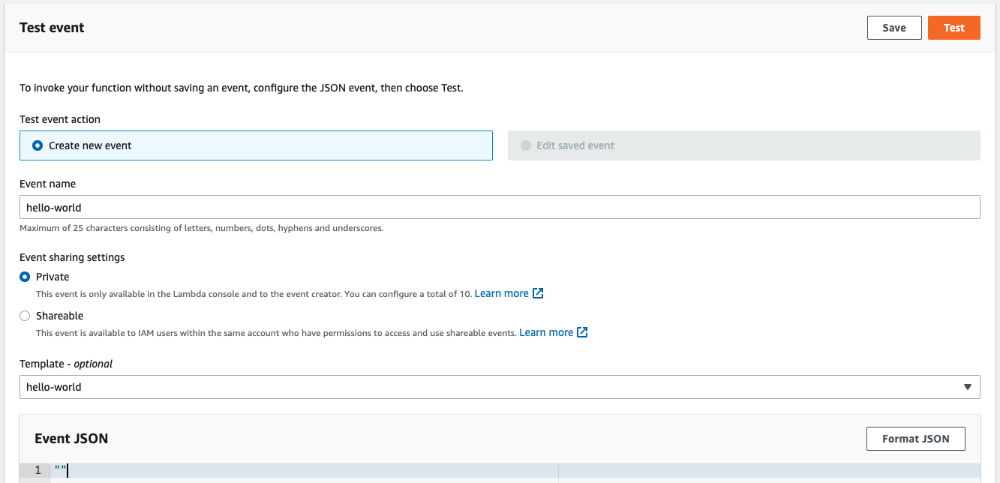
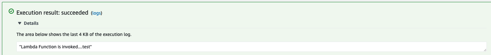

The example project for StringBoot service

<div align="center">
    
</div>

## Getting Started

## Project structure
```
.
├── hello-world
│   ├── src
|   ├── pom.xml
│   ...
├── terraform
|
└── README.md
```

## Prerequisites
- Install [AWS CLI](https://docs.aws.amazon.com/cli/latest/userguide/cli-configure-quickstart.html)

Make sure that you have a [Amazon Account](https://aws.amazon.com/account/) and configurate aws account in ~/.aws/credentials
```
[default]
aws_access_key_id=<your-key>
aws_secret_access_key=<your-key>
```

- Install [Terraform](https://learn.hashicorp.com/tutorials/terraform/install-cli)

## Build and deploy

Build and deploy all in once by run command
```shell script
$ sh build_and_deploy.sh
```

Or step by step as below

### Build spring-boot application

- Build & start project
```shell script
$ cd hello-world
$ ../mvnw clean package
...
[INFO] ------------------------------------------------------------------------
[INFO] BUILD SUCCESS
[INFO] ------------------------------------------------------------------------
[INFO] Total time:  13.632 s
[INFO] Finished at: 2022-10-03T14:26:40+07:00
[INFO] ------------------------------------------------------------------------
$ cd ..
```

### Create AWS Lambda 

```shell script
$ cd terraform
$ terraform init
$ terraform apply
$ cd ..
```

## Testing

Create test event in huypva_hello_world function

<div align="center">
    
</div>

And result

<div align="center">
    
</div>

## Destroy resource on AWS

```shell script
$ cd terraform
$ terraform destroy
$ cd ..
```

## Contributing

The code is open sourced. I encourage fellow developers to contribute and help improve it!

- Fork it
- Create your feature branch (git checkout -b new-feature)
- Ensure all tests are passing
- Commit your changes (git commit -am 'Add some feature')
- Push to the branch (git push origin my-new-feature)
- Create new Pull Request

## Reference

## License
This project is licensed under the Apache License v2.0. Please see LICENSE.md located at the project's root for more details.