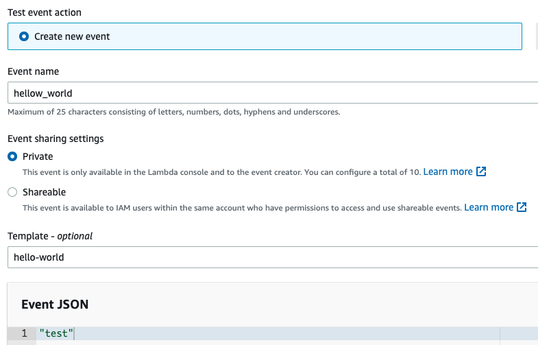

The example project for StringBoot service

<div align="center">
    
</div>

## Getting Started

## Project structure
```
.
├── hello-world
│   ├── src
|   ├── pom.xml
│   ...
├── infrastructure
|
└── README.md
```

## Prerequisites
- Make sure that you have Docker and Docker Compose installed
  - Windows or macOS:
    [Install Docker Desktop](https://www.docker.com/get-started)
  - Linux: [Install Docker](https://www.docker.com/get-started) and then
    [Docker Compose](https://github.com/docker/compose)

## Build spring-boot application

- Build & start project
```shell script
$ cd hello-world
$ ../mvnw clean package
...
[INFO] ------------------------------------------------------------------------
[INFO] BUILD SUCCESS
[INFO] ------------------------------------------------------------------------
[INFO] Total time:  13.632 s
[INFO] Finished at: 2022-10-03T14:26:40+07:00
[INFO] ------------------------------------------------------------------------
```

### Create AWS Lambda 

```shell script
$ cd infrastructure
$ terraform init
$ terraform apply
```

## Testing

Create test event in huypva_hello_world function

<div align="center">
    
</div>

And result

### Destroy resource on AWS

```shell script
$ terraform destroy
```

## Contributing

The code is open sourced. I encourage fellow developers to contribute and help improve it!

- Fork it
- Create your feature branch (git checkout -b new-feature)
- Ensure all tests are passing
- Commit your changes (git commit -am 'Add some feature')
- Push to the branch (git push origin my-new-feature)
- Create new Pull Request

## Reference

## License
This project is licensed under the Apache License v2.0. Please see LICENSE.md located at the project's root for more details.